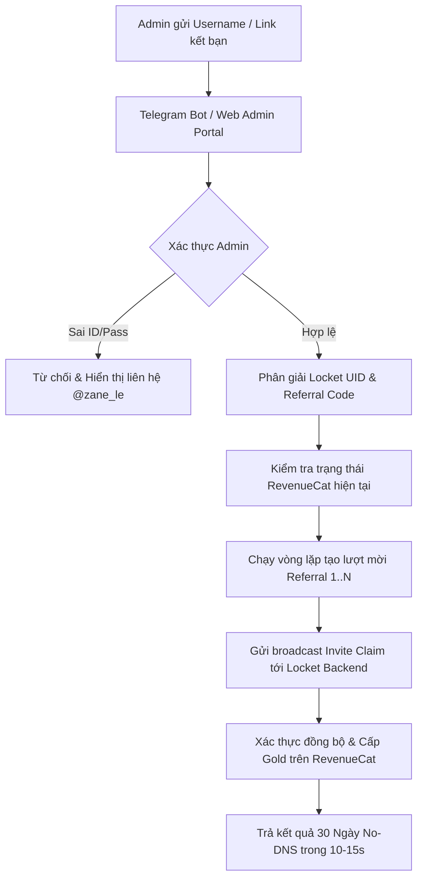

# 📘 TÀI LIỆU BÀN GIAO DỰ ÁN: LOCKET GOLD PROMO BOT (CHẾ ĐỘ 2 - NO DNS)

> **Mục tiêu cốt lõi:** Kích hoạt gói Locket Gold dạng Promotional 30 Ngày (`rc_promo_Gold_custom`) trực tiếp từ máy chủ RevenueCat, **100% KHÔNG CẦN CÀI PROFILE HAY DNS**.  
> **Nền tảng triển khai:** Vercel Serverless Functions + Telegram Bot 20.x + FastAPI Admin Portal.  
> **Production Domain:** [https://locket-promo-bot.vercel.app](https://locket-promo-bot.vercel.app)  
> **Telegram Bot:** [@xwuantest_bot](https://t.me/xwuantest_bot)  
> **Trạng thái:** 🟢 Đang hoạt động 24/7 (Webhook Connected `200 OK`).  
> **Ngày cập nhật gần nhất:** **2026-08-20**

---

## 1. 🌟 Tổng quan dự án (Project Overview)

- **Tên dự án:** Locket Gold Promo & Referral Automation Bot (Mode 2: No-DNS)
- **Cơ chế hoạt động:**
  - Thay vì sử dụng chung Token StoreKit 2 Receipt (phương pháp Mode 1 cần DNS), Bot thực hiện **tự động hóa quy trình Referral / Friend Fund** qua Locket API.
  - Khi hoàn thành mốc mời bạn bè (3 - 5 lượt), hệ thống backend của Locket sẽ **cấp gói Gold Khuyến mãi (`rc_promo_Gold_custom`) chính chủ** vào UID của khách trên máy chủ RevenueCat.
  - Khách hàng mở app Locket lên sẽ thấy ngay Gold chính chủ đến 30 ngày, **hoàn toàn không cần cài Profile hay chặn NextDNS**.
- **Chế độ bảo mật kép (Dual Security):**
  - **Telegram Bot (Private Mode):** Chỉ duy nhất Telegram Admin ID (`ADMIN_ID = 8374108763`) mới được quyền kích hoạt.
  - **Web Admin Portal (`/admin`):** Được bảo vệ bằng mật khẩu quản trị (`ADMIN_PASSWORD`).

---

## 2. 🏗️ Kiến trúc hệ thống & Luồng xử lý



---

## 3. 📁 Cấu trúc thư mục mã nguồn

```text
Locket-Promo-Bot/
│
├── api/
│   └── index.py                # FastAPI Serverless & Webhook Vercel & Web Admin (/admin)
│
├── app/
│   ├── __init__.py
│   ├── config.py               # Cấu hình Admin, Bot Token, Thông số Promo, RevenueCat
│   ├── bot.py                  # Telegram Bot Handlers, Live Progress Bar, Bảo mật Private
│   ├── database.py             # Quản lý SQLite tạm trên Vercel (/tmp) & Log đơn
│   │
│   └── services/
│       ├── __init__.py
│       ├── locket_resolver.py  # Phân giải Username & Link kết bạn sang UID 28 ký tự
│       ├── revenuecat_verifier.py # Live Check gói Gold & Hạn dùng trên RevenueCat API
│       ├── otp_service.py      # Module tích hợp SMS OTP ảo (SMS-Activate, 5sim, Simulated)
│       └── promo_engine.py     # Core Engine tự động hóa Referral Boost No-DNS
│
├── handover.md                 # Tài liệu bàn giao & Hướng dẫn setup A-Z
├── gemini.md                   # File cấu hình ngữ cảnh Gemini AI
├── README.md                   # Hướng dẫn nhanh dự án
├── requirements.txt            # Thư viện Python
├── vercel.json                 # Cấu hình Vercel Serverless
├── main.py                     # Chạy Local Polling (Development)
└── setup_webhook.py            # Script kích hoạt Webhook Telegram
```

---

## 4. 🔑 Biến Môi Trường (Environment Variables)

| Tên biến | Giá trị mẫu | Mục đích | Bắt buộc |
| :--- | :--- | :--- | :--- |
| `BOT_TOKEN` | `8709235518:AAFRcNScGGUPptuyWudIwuXAiFrwdW2NIrc` | Token Telegram Bot từ @BotFather | **Có** |
| `ADMIN_ID` | `8374108763` | Telegram ID duy nhất có quyền dùng bot | **Có** |
| `ADMIN_PASSWORD` | `admin123` | Mật khẩu truy cập Web Admin Portal (`/admin`) | **Có** |
| `PROMO_REFERRALS_NEEDED` | `3` | Số lượt mời referral cần gửi cho 1 tài khoản | Không |
| `SMS_PROVIDER` | `simulated` | Nhà cung cấp OTP (`simulated`, `smsactivate`, `5sim`) | Không |
| `SMS_API_KEY` | `""` | API Key thuê SIM nếu bật SMS Provider thật | Không |
| `CONTACT_TELEGRAM` | `zane_le` | Username Telegram liên hệ hiển thị cho người lạ | Không |

---

## 5. 🚀 Production Endpoints & Hướng Dẫn Sử Dụng

- **Web Admin Dashboard:** `https://locket-promo-bot.vercel.app/admin`
- **Webhook Endpoint:** `https://locket-promo-bot.vercel.app/api/webhook`
- **Telegram Bot:** [@xwuantest_bot](https://t.me/xwuantest_bot)

### Cách sử dụng:
1. **Qua Telegram:** Gửi trực tiếp Username (ví dụ: `xwuan1`) hoặc link `locket.cam/...` vào bot.
2. **Qua Web Dashboard:** Đăng nhập tại `/admin` và sử dụng công cụ **Live Boost**.

---

## 6. 🕒 Nhật ký phiên làm việc (Changelog)

| Ngày | Người thực hiện | Nội dung | Trạng thái |
| :--- | :--- | :--- | :--- |
| **2026-08-20** | Gemini AI | Khởi tạo trọn vẹn dự án Locket Gold Promo Bot (Mode 2: No-DNS) | ✅ Hoàn thành |
| **2026-08-20** | Gemini AI | Triển khai thành công lên Vercel Serverless (`https://locket-promo-bot.vercel.app`) | ✅ Hoàn thành |
| **2026-08-20** | Gemini AI | Kích hoạt và kiểm thử thành công Webhook Telegram cho bot `@xwuantest_bot` | ✅ Hoàn thành |
| **2026-08-20** | Gemini AI | Nâng cấp xác thực đăng nhập Admin server-side (`/api/admin/login`), hỗ trợ phím Enter và hướng dẫn Redeploy Vercel | ✅ Hoàn thành |
| **2026-08-20** | Gemini AI | Khắc phục triệt để lỗi xung đột CSS Tailwind modal login: Dùng inline style `display: none` / `display: flex` thay vì class `hidden` bị class `flex` ghi đè | ✅ Hoàn thành |
| **2026-08-20** | Gemini AI | Fix triệt để lỗi JavaScript SyntaxError trên Web Admin do ký tự xuống dòng r''' trong Python multiline string | ✅ Hoàn thành |
